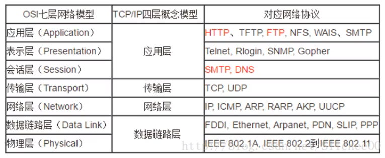
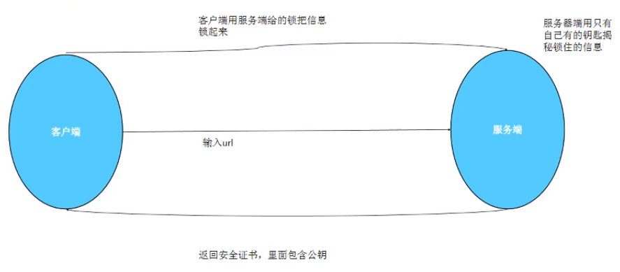

#### 协议是整个互联网沟通的基础
* https://note.youdao.com/group/#search?keyword=kak&gid=93843299(https协议)
* ws:127.01.03.1(websocket协议)
#### 网络模型


* FTP协议是文件传输协议
#### TCP/IP协议
* IP地址给计算机分发IP，有了IP计算机才能连上英特网，IP是互联网的基础；
* IP协议让电脑都处于可以互相找到的互联网中，而TCP就是把它们联结起来；
* 三次握手四次挥手。
#### TCP/UDP协议
* TCP协议建立连接进行传输，更加安全可靠；
* UDP协议不建立连接进行传输。
#### Http,Https,Http2
* 他们都是基于TCP/IP协议建立起的管道上的；
* 都用于web通讯。
#### Http VS Https
* Https相当于进行了安全加密的Http。


#### Http VS Http2(目前不普及)
* Http协议无状态，每次数据传输完成后就会断开TCP连接，Http1.1在请求头中加入```Connection:keep-alive```不能保持TCP连接不断开，Http2进行了多路复用，对同一地址的请求会保留TCP连接，多次请求省去了3次握手和4次挥手；
* Http2进行了头部压缩；
* Http2可以进行服务器推送，服务端可以主动向客户端推送消息。
#### Websocket
* 也是TCP协议建立的管道基础上进行的通信；
* 可以理解成浏览器使用的即时通讯的协议；
* ws协议可以从服务端向客户端发消息，也可以从客户端向服务端发消息，因此可以用于做聊天室。
// 生成证书指令(需要下载Git)
// 生成私钥
// openssl genrsa 1024 > [路径、文件名]
// 根据私钥生成公钥
// openssl req -new -key [路径、文件名] -out csr.pem
// 根据公钥和私钥生成证书
// openssl x509 -req -days 365 -in csr.pem -signkey private.pem -out file.crt