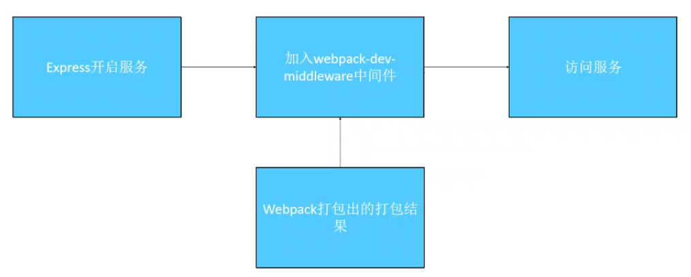
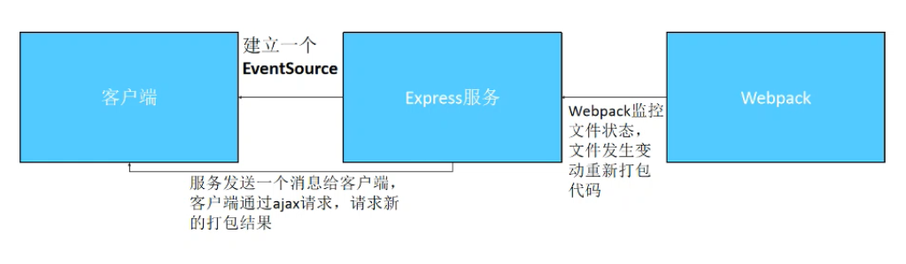

#### 为什么要用webpack-dev-server
* 本地的调试和线上的调试始终是有差距的，我们经常需要一个模拟的线上环境进行调试；
* 开发模式下提供的调试功能，让我们调试起来更加的方便。
#### webpack-dev-server通常会开启的功能
* 热更新
* source-map
* 代理接口
#### webpack-dev-server命令使用全局webpack打包，npm run [dev]命令使用工程内webpack打包。
#### 热更新是不用刷新浏览器的情况下预览效果,并保持当前项目的状态。不配置热更新时会触发webpack默认配置reloader,项目回到初始状态。
#### Vue对于js部分是reloader，对于css部分是热更新。
#### devServer是开发时生效的配置，项目上线后不起作用，配置接口代理解决跨域问题只在开发时起效，真正解决跨域问题需要后台设置响应头。
#### 跨域问题是由于js请求后台数据时，考虑安全性，会拒绝来自未授权协议、域名、端口号的请求。前端使用接口代理，使用node发送请求，就可以解决跨域问题。
#### webpack-dev-server是怎么工作的

#### 热更新是怎么工作的

#### 手写webpack-dev-server
<code>
<pre>
    "dependencies": {
        "css-loader": "^3.0.0",
        "express": "^4.17.1", // webpack-dev-server依赖express
        "html-webpack-plugin": "^3.2.0",
        "http-proxy-middleware": "0.19.1", // 负责接口代理的中间件
        "style-loader": "^0.23.1",
        "webpack": "^4.35.2",
        "webpack-cli": "^3.3.5",
        "webpack-dev-middleware": "^3.7.0", // 负责开启服务的中间件
        "webpack-hot-middleware": "2.25.0" // 负责热更新的中间件
    }
</pre>
</code>

#### 如何学习webpack
* 从应用入手学习基础使用；
* 学习webpack的最佳实践；
* 学习一些原理。