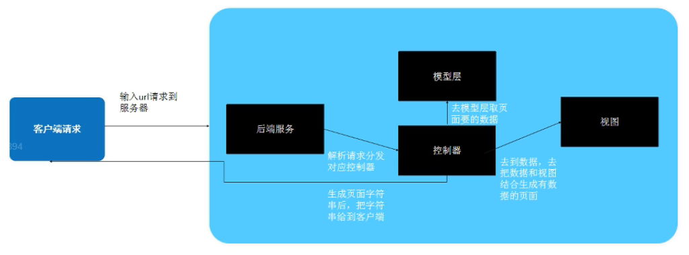
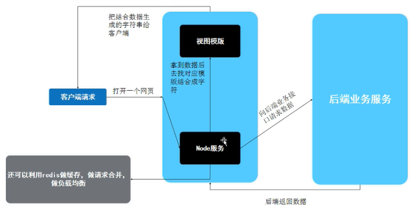

#### MVC模式工作历程

* 前后端不分离；
* 开发效率低，不适合分工合作；
* 前端能力低，前端工作少，只需写静态页面和js效果。
#### MVVM模式工作历程

* 前后端分离；
* 客户端压力过大，首屏渲染过慢；
* SU性不好，不便于从搜索引擎找到网页。
#### 前端工程师必备条件
* Vue,React,Angular三个框架至少掌握一个；
* 了解Http协议；
* 了解前端自动化工具npm, webpack等。
#### Node作为中间层流程图

* 前后端分离；
* 中间层可以做复杂的数据操作，渲染数据，可以提供ssr的功能，解决了SU的问题，还可以利用redis做缓存，做请求合并，做负载均衡。

#### 技术选型要选哪些东西
* Node框架；
* 视图模版；
* 其他工具（数据库，redis搭配的工具）。
#### Node框架选型
* 主流node框架express(最早、用的最多),koa(减去了express自带的部分模块，如路由模块，使用时需自定义),egg(koa的加强版，适合企业级应用)；
* Node框架选型考虑点：要做什么，团队人员能力，框架特点，团队习惯。
#### 视图模版选择
* 视图模版种类繁多，比较流行的有pug(jade),art-template,ejs；
* 视图模版引擎选型：性能，支持性，看你喜欢哪个。
#### 步骤总结
* 框架选型 => 项目架构 => 配置app.js => 编写代码；
* app.js里可以配置路由，一个路由对应一个控制器；
* 控制器里请求数据，也可以做缓存、负载均衡操作。
#### Node的作用
* 搭建全站
* 中间层开发
* 模拟数据接口
* 制作项目构建工具（webpack, glup）